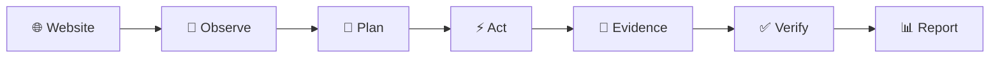
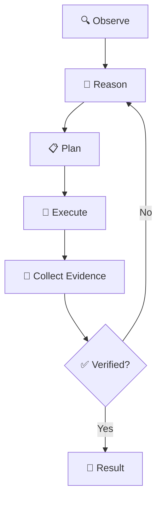

<div align="center">

# ⚡ DropSeo

### AI Agent that explores, audits & understands websites.


<br/>

[](https://drop-seo.vercel.app/)


</div>

---

## 🧠 How DropSeo Works



---

## ⚡ Agent Loop



---

## ✨ What It Does

|     | Capability                       |
| --- | -------------------------------- |
| 🤖  | Autonomous website investigation |
| 🧭  | Intelligent browser navigation   |
| 🔍  | Detect website & SEO issues      |
| 📸  | Collect evidence                 |
| 🔄  | Recover from failed actions      |
| ✅   | Verify results                   |
| 🛡️ | Safe agent guardrails            |

---

## 🏗️ Architecture

```text
        🌐 Website
            │
            ▼
     ┌──────────────┐
     │  DropSeo AI  │
     │    Agent     │
     └──────┬───────┘
            │
     ┌──────▼───────┐
     │   WebCMD     │
     │ Browser Layer│
     └──────┬───────┘
            │
       ┌────┴────┐
       ▼         ▼
    🔍 Audit   📸 Evidence
       │         │
       └────┬────┘
            ▼
       📊 Results
```

---

## 🚀 Run Locally

```bash
git clone <your-repository-url>
cd drop-seo
npm install
npm run dev
```

---

## 🛡️ Guardrails

```text
✅ Same-domain navigation
✅ Safe browser interaction
✅ Evidence-based verification

❌ Sensitive data submission
❌ Destructive actions
❌ Consequential transactions
```

---

## 🏆 Built for WebCMD Hackathon

<div align="center">

**Observe → Reason → Act → Verify**

### 🌐 [Try DropSeo](https://drop-seo.vercel.app/)

Built by **[Govind Nagar](https://github.com/govind-codex)**

⭐ **Star the repo if you like the project!**

</div>
